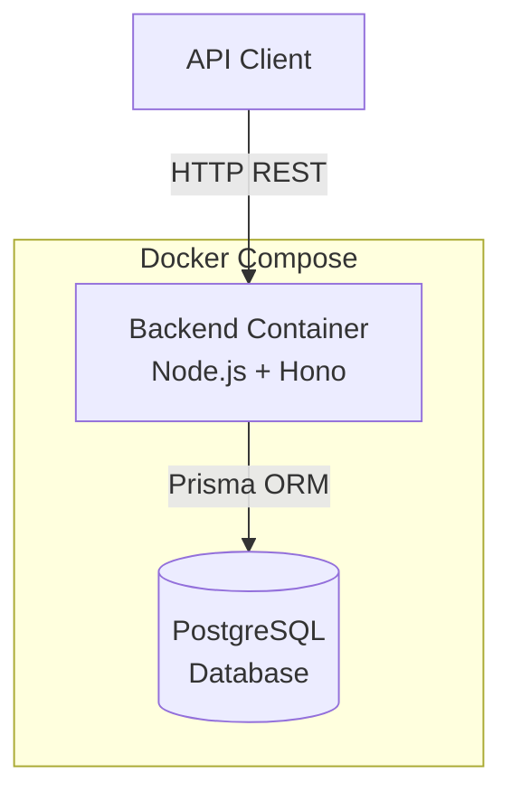

# Docker Backend Infrastructure Plan

## Architecture Overview



## 1. Backend HTTP Server Setup

Create the Hono server in [apps/backend/src/server.ts](apps/backend/src/server.ts):

- Initialize Hono app with CORS and JSON middleware
- Health check endpoint (`GET /health`)
- Mount route groups: `/games`, `/agents`, `/rounds`, `/analytics`
- Error handling middleware
- Graceful shutdown handling

Entry point [apps/backend/src/index.ts](apps/backend/src/index.ts):

- Import server, start on configurable port (default 3000)
- Connect Prisma on startup

## 2. API Routes Implementation

Leverage existing route files structure:

**Games** (`/games`):

- `POST /` - Create game with config
- `GET /:id` - Get game by ID
- `GET /` - List games (with status filter)
- `PATCH /:id/status` - Update game status (start/pause/resume)
- `POST /:id/rounds` - Execute next round
- `POST /:id/simulate` - Run full simulation

**Agents** (`/agents`):

- `POST /games/:gameId/agents` - Add agent to game
- `GET /games/:gameId/agents` - List agents in game
- `DELETE /games/:gameId/agents/:agentId` - Remove agent

**Analytics** (`/analytics`):

- `GET /games/:gameId/stats` - Get game statistics
- `GET /games/:gameId/history` - Get attendance/benefit history

## 3. Docker Configuration

**[docker/backend_dockerfile](docker/backend_dockerfile)**:

```dockerfile
FROM node:22-alpine
# Install pnpm, copy workspace, build, expose port
```

Key considerations:

- Multi-stage build (build stage + runtime stage)
- Copy only necessary packages (backend + shared)
- Generate Prisma client in build
- Run as non-root user

**[docker/docker-compose.yaml](docker/docker-compose.yaml)**:

```yaml
services:
  postgres:
    image: postgres:16-alpine
    volumes, healthcheck, env vars
  
  backend:
    build: backend_dockerfile
    depends_on: postgres (healthy)
    environment: DATABASE_URL
```

**[docker/init.sql](docker/init.sql)**:

- Create database and extensions if needed

## 4. Environment and Scripts

- Add `.env.example` with all required variables
- Add npm scripts: `docker:up`, `docker:down`, `docker:logs`
- Prisma migration script for container startup

## File Changes Summary

| File | Action |

|------|--------|

| `apps/backend/src/server.ts` | Create Hono server |

| `apps/backend/src/index.ts` | Create entry point |

| `apps/backend/src/routes/games.ts` | Implement CRUD routes |

| `apps/backend/src/routes/agents.ts` | Implement agent routes |

| `apps/backend/src/routes/analytics.ts` | Implement stats routes |

| `apps/backend/package.json` | Add start script |

| `docker/backend_dockerfile` | Create Dockerfile |

| `docker/docker-compose.yaml` | Create compose config |

| `docker/init.sql` | Create DB init script |

| `docker/.env.example` | Create env template |