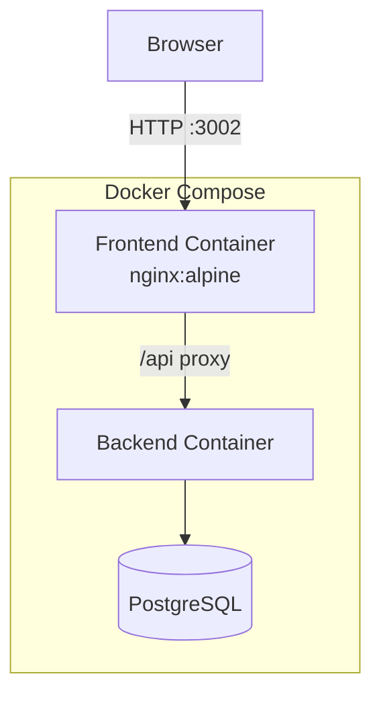

# Frontend Infrastructure Setup

## Architecture Overview



## 1. Vite Configuration

Update [apps/frontend/vite.config.ts](apps/frontend/vite.config.ts):

- React plugin with SWC for fast builds
- Dev server proxy to backend API (`/api` -> `http://localhost:3001`)
- Build output to `dist/` folder
- Base path configuration for deployment
```typescript
import { defineConfig } from 'vite'
import react from '@vitejs/plugin-react-swc'

export default defineConfig({
  plugins: [react()],
  server: {
    port: 5173,
    proxy: {
      '/api': {
        target: 'http://localhost:3001',
        changeOrigin: true,
        rewrite: (path) => path.replace(/^\/api/, ''),
      },
    },
  },
  build: {
    outDir: 'dist',
  },
})
```


## 2. Package.json Dependencies

Update [apps/frontend/package.json](apps/frontend/package.json) with:

**Dependencies:**

- `react`, `react-dom` (^18.x)
- `@el-farol/shared` (workspace)

**Dev Dependencies:**

- `vite`, `@vitejs/plugin-react-swc`
- `tailwindcss`, `postcss`, `autoprefixer`
- `@types/react`, `@types/react-dom`
- `typescript`

**Scripts:**

- `dev`: vite
- `build`: vite build
- `preview`: vite preview

## 3. Tailwind CSS Setup

Create configuration files:

- [apps/frontend/tailwind.config.js](apps/frontend/tailwind.config.js) - content paths, theme
- [apps/frontend/postcss.config.js](apps/frontend/postcss.config.js) - tailwind + autoprefixer plugins
- [apps/frontend/src/index.css](apps/frontend/src/index.css) - Tailwind directives

## 4. Entry Point Templates

**[apps/frontend/index.html](apps/frontend/index.html):**

- HTML shell with `<div id="root">`
- Vite script entry point

**[apps/frontend/src/main.tsx](apps/frontend/src/main.tsx):**

- React 18 createRoot
- Import global CSS
- Render `<App />`

**[apps/frontend/src/app.tsx](apps/frontend/src/app.tsx):**

- Main App component shell
- Import existing components (placeholders)

## 5. Component Templates

Create minimal React FC stubs with Tailwind classes for existing files:

- `components/agent_editor.tsx` - Agent code editor component
- `components/gameconfig_form.tsx` - Game configuration form
- `components/round_stats.tsx` - Round statistics display
- `components/simulation_viz.tsx` - Simulation visualization

## 6. API Client Templates

Populate with typed fetch wrappers:

- `api/client.ts` - Base fetch client with error handling
- `api/games.ts` - Game CRUD operations
- `api/analytics.ts` - Analytics data fetching

## 7. Docker Configuration

**[docker/frontend_dockerfile](docker/frontend_dockerfile):**

```dockerfile
# Build stage
FROM node:22-alpine AS builder
# Install pnpm, copy workspace, build with vite

# Production stage  
FROM nginx:alpine
COPY --from=builder /app/apps/frontend/dist /usr/share/nginx/html
COPY nginx.conf /etc/nginx/conf.d/default.conf
```

**[docker/nginx.conf](docker/nginx.conf):**

- Serve static files from `/usr/share/nginx/html`
- SPA fallback (try_files to index.html)
- API proxy to backend container

**Update [docker/docker-compose.yaml](docker/docker-compose.yaml):**

- Add frontend service
- Port mapping (3002:80)
- Depends on backend

## Files Summary

| File | Action |

|------|--------|

| `apps/frontend/package.json` | Update deps & scripts |

| `apps/frontend/vite.config.ts` | Create config |

| `apps/frontend/tailwind.config.js` | Create |

| `apps/frontend/postcss.config.js` | Create |

| `apps/frontend/index.html` | Create |

| `apps/frontend/src/index.css` | Create |

| `apps/frontend/src/main.tsx` | Populate |

| `apps/frontend/src/app.tsx` | Populate |

| `apps/frontend/src/components/*.tsx` | Populate stubs |

| `apps/frontend/src/api/*.ts` | Populate stubs |

| `docker/frontend_dockerfile` | Create |

| `docker/nginx.conf` | Create |

| `docker/docker-compose.yaml` | Update |