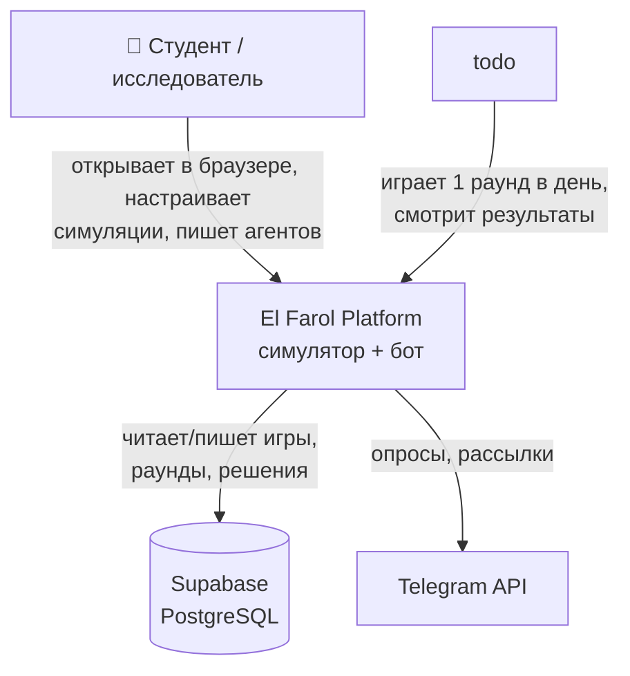
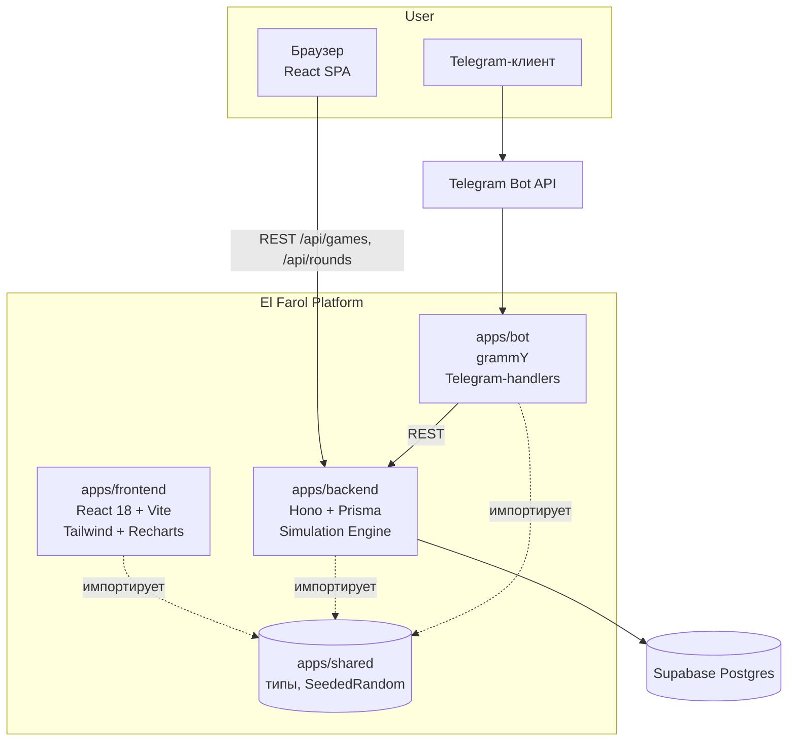
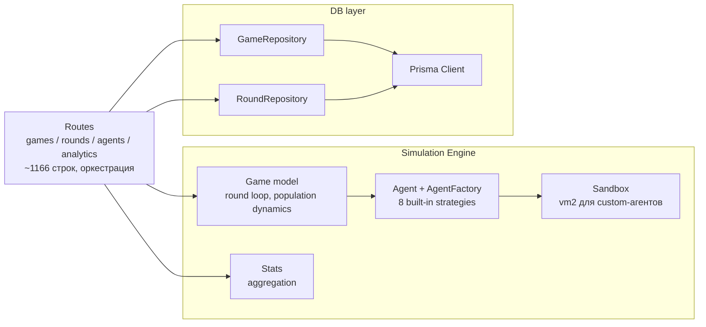
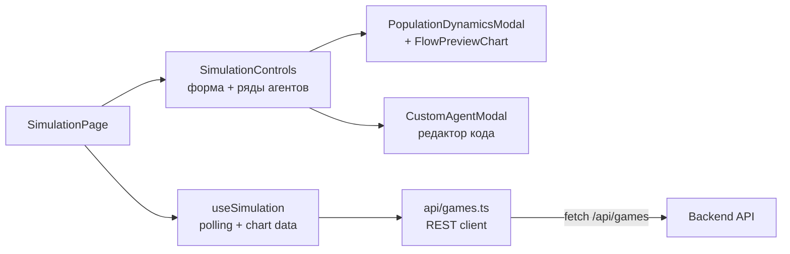

**El Farol Bar Problem** — классическая задача теории игр Брайана Артура: 100 человек решают,
идти ли им в бар. Если придёт **больше 60** — всем плохо (давка, очереди, минусовая полезность).
Если меньше — пришедшие выигрывают. Решение принимается **одновременно**, без сговора, на основе
истории посещений предыдущих раундов.


### Зачем это вам

- **Студенту-экономисту** — увидеть в реальном времени, как из эгоистичных решений рождается
  колебательный равновесный паттерн вокруг capacity.
- **Преподавателю** — готовая демонстрация для лекции по теории игр / поведенческой экономике.
- **Любителю стратегий** — площадка, чтобы написать свою и посмотреть, обыграет ли она
  адаптивного агента с обучением.

---

## Как пользоваться

Откройте [el-farol.vercel.app](https://el-farol-f740yqh99-sarkibartierbittis-projects.vercel.app/) → вкладка **«Симуляция»**.

### Шаг 1 — настройте бар

| Поле                         | Что означает                                                  |
|------------------------------|----------------------------------------------------------------|
| Количество агентов           | Сколько потенциальных посетителей в пуле                      |
| Capacity (% от общего кол-ва)| Порог переполненности (60% = классический сетап Артура)     |
| Раунды                       | Длительность симуляции                                        |

Полезность за раунд: **+1 за каждого посетителя при посещении ≤ capacity, иначе −1 за каждого**.

### Шаг 2 — соберите состав агентов

Добавьте ряды, выберите тип каждого, укажите количество. Сумма должна равняться общему числу агентов.
Иконка ⚙ справа от ряда открывает параметры конкретной стратегии (порог, окно памяти,
скорость адаптации и т.д.).

### Шаг 3 — (опционально) задайте динамику популяции

Нажмите **«Настроить»** в блоке *Динамика популяции*. В одном окне:

- **Активная популяция** — старт / мин / макс одновременно активных агентов.
- **Распределения прихода и ухода** — Пуассон / равномерное / экспоненциальное / гамма / биномиальное.
- **Расписание** для каждого потока — стартовый и конечный раунд, длина fade-in и fade-out.
- **Превью-график справа** — теоретическое среднее ± σ по раундам, обновляется на лету,
  пока вы крутите параметры. Видно сразу, как будет выглядеть приток/отток до запуска симуляции.

### Шаг 4 — запустите и наблюдайте

После старта обновляются три графика:

1. **Посещение от раунда** — с линией capacity.
2. **Активная популяция и потоки** — кто пришёл, кто ушёл, сколько в баре сейчас.
3. **Таблица статистики** — средняя посещаемость, σ, эффективность (доля от теоретического оптимума).

Кнопка **«Сброс»** возвращает к настройкам.

### Кастомный агент

Выберите тип ряда `custom`, нажмите ⚙ → откроется редактор кода. Кнопка **«Вставить пример»**
подкладывает рабочий шаблон. Код исполняется в изолированном sandbox.

```js
// available variables: history (array of past attendances), capacity (number)
function decide(history, capacity) {
  const recent = history.slice(-5);
  const avg = recent.reduce((a, b) => a + b, 0) / Math.max(recent.length, 1);
  return avg < capacity; // true = go, false = stay home
}
```

---

## 🛠 Для разработчика

### Стек

NB: Бот пока не реализован. Для работы с telegram/ботом обсуждается рекомендованная архитектура

- **Backend** — Hono (Node) + Prisma + PostgreSQL (Supabase). REST API + симуляционный движок.
- **Frontend** — React 18 + Vite + Tailwind + Recharts.
- **Bot** — Предлагается реализация с помощью grammY (Telegram), читает/пишет через тот же backend. Пока не реализован.
- **Shared** — пакет с TypeScript-типами и SeededRandom, переиспользуется тремя сервисами.
- **Deploy** — Vercel (frontend + backend через `api/[[...path]].ts`), Supabase (PostgreSQL),
  Docker (backend + nginx).

### Архитектура — нотация C4

#### Уровень 1. System Context

Кто взаимодействует с системой и через что.



#### Уровень 2. Containers

Из чего собрана система.



#### Уровень 3. Components — Backend

Внутреннее устройство backend-контейнера.

Backend сейчас без явного сервисного слоя: route handlers напрямую оркестрируют
`SimulationEngine` и репозитории. Папка `apps/backend/src/services/` зарезервирована для
будущей экстракции, пока не используется.



#### Уровень 3. Components — Frontend



### Схема данных (Prisma)

```
Game ──< GameAgent >── Agent
  │           │
  │           └──< Decision >── Round
  └──< Round
```

Ключевые таблицы: `games`, `agents`, `game_agents` (M:N + per-game статистика),
`rounds`, `decisions`. JSON-поля: `Game.benefit_rules`, `Game.population_dynamics`
(включая `schedule` каждого потока). Полный схема-файл — [apps/backend/prisma/schema.prisma](apps/backend/prisma/schema.prisma).

### Симуляционный движок: что считается за раунд

1. `updateActivePopulation()` — sample прихода и ухода из заданных распределений,
   с применением schedule-scale (`computeScheduleScale(round, schedule)`).
2. Для каждого активного агента `agent.predict(history, capacity)` → `boolean`.
   Custom-агенты исполняются в `vm2`-sandbox.
3. `attendance = Σ decisions`, `benefit = attendance ≤ capacity ? attendance : -attendance`.
4. История пишется в память, периодически сбрасывается в Postgres через `RoundRepository`.

Все случайности идут через `SeededRandom(id)` — игры воспроизводимы по id.

### Локальный запуск

```bash
pnpm install
pnpm --filter @el-farol/shared build      # компилируем shared в lib/
cp apps/backend/env.example apps/backend/.env  # выставить DATABASE_URL

# применить схему
pnpm db:push

# параллельно
pnpm dev:backend   # hono на :3001
pnpm dev:frontend  # vite на :5173
```

Docker:

```bash
docker compose up -d   # backend + frontend(nginx) + postgres
```

Скрипты в [package.json](package.json), Dockerfiles — в [docker/](docker/).

### Структура репозитория

```
apps/
  backend/      Hono API + Prisma + simulation engine
    prisma/    schema.prisma, init.sql, migrations/
    src/       routes/, services/, core/{db,simulation-engine}/
  frontend/    React + Vite UI
    src/       pages/, components/, hooks/, api/, types/
  bot/         Telegram bot (grammY)
  shared/      типы + SeededRandom (импортируется всеми)

analysis/      Python-скрипты офлайн-анализа сценариев
docker/        Dockerfiles + nginx.conf
api/           Vercel serverless entry для backend
```

### Деплой

- **Vercel** — фронт собирается из `apps/frontend`, backend проксируется через
  [api/[[...path]].ts](api/%5B%5B...path%5D%5D.ts) как serverless-функция.
- **Supabase** — Postgres. Применить [apps/backend/prisma/init.sql](apps/backend/prisma/init.sql)
  один раз; миграции — в [apps/backend/prisma/migrations/](apps/backend/prisma/migrations/).

### Вклад

Ветки `feature/*`, PR в `main`. Type-check обязателен:

```bash
pnpm --filter @el-farol/backend type-check
pnpm --filter @el-farol/frontend type-check
```

Не коммитьте `apps/*/src/**/*.js|.d.ts` — это артефакты компилятора, .gitignore их ловит.
